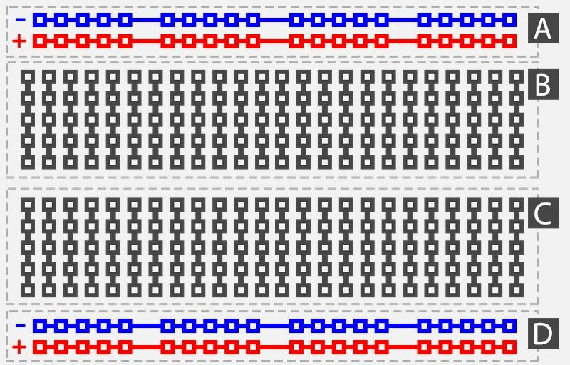

# Notes_01

## Solderless Breadboard

  
* For prototyping and experimenting
* Multiple breadboards can be connected together
* **Power Rails** - Areas A & D  
  * Used to conduct the plus/minus voltages across the entire length of the board
  * Power Rails on either side are not connected
  * `+` => Power
  * `-` => Ground
  * Columns are electrically separated.
* **Terminal Strips** B & C 
   * To connect the terminal pins of circuit components
   * Rows are electrically connected unless there is a break
 * **Ravine**
   * Isolates both terminal strips so they are not electrically connected to one another.
 * **Jumper Wires**
   * Used to connect between the terminal strip areas.
   * Can also be used to connect the the power rails into the terminal strip areas. 
* **DIP Support**
  * *Dual in-line Package*
  * Integrated circuits (ICs) are often manufactured to fit on breadboards
  * ICs are packaged to take up less space (DIP)
    * The legs of a DIP chip are spaced so that the chip fits in the ravine
    * Components can be connected to each side of the IC without interfering with the functionality of the opposite leg
* **Powering the Breadboard**
  * Pull power from an `Arduino`
  * Binding Posts allow you to connect external power sources
    * Connect to breadboard with jumper wires
  * Bench-top Power Supply 
    * Provide a wide range of voltage and current
  * Breadboard Power Supply

---

## Currents

* **Types**
  * Direct Current (DC)
    * Electrons flow in a single direction
    * Polarity is constant.
  * Alternating Current (AC)
    * Flow of electrons change
    * The change from one polarity to another is called a `cycle`
    * The rate at which the cycle repeats is called `frequency`
      * Frequency is measured in *cycles per second*, called `hertz`
* **Resistors**
  * A two-terminal component that implements electrical resistance as a circuit element
  * Measured in `OHMS`
  * Used to:
    * Reduce the current flow
    * Adjust signal levels
    * Divide voltages
    * Bias active elements
    * Terminate transmission lines
    * etc.
  * Types:
    * Fixed
    * Variable
      * To adjust circuit elements
      * As sensing devices
        * Heat
        * Light
        * Humidity
        * Force
        * Chemical activity
  